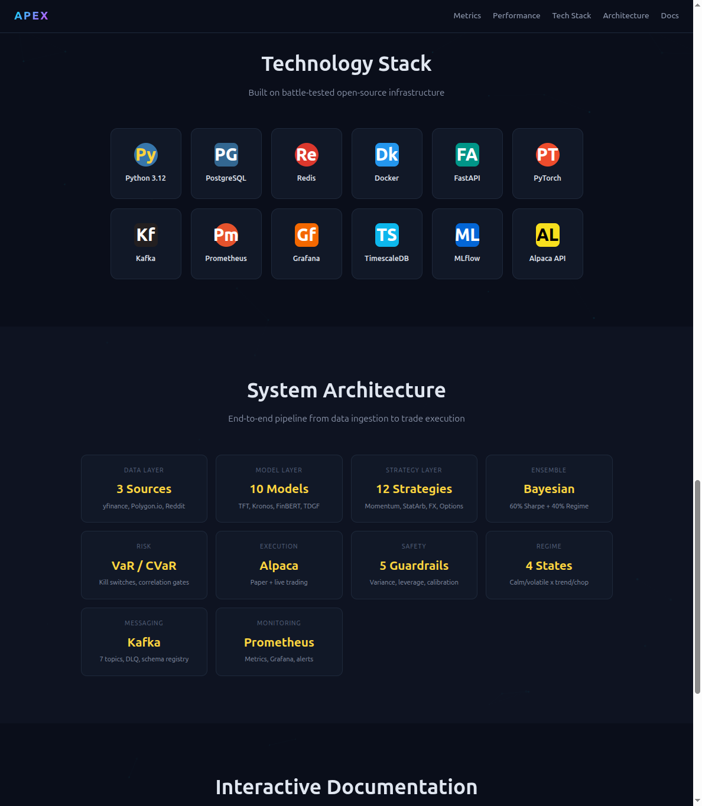
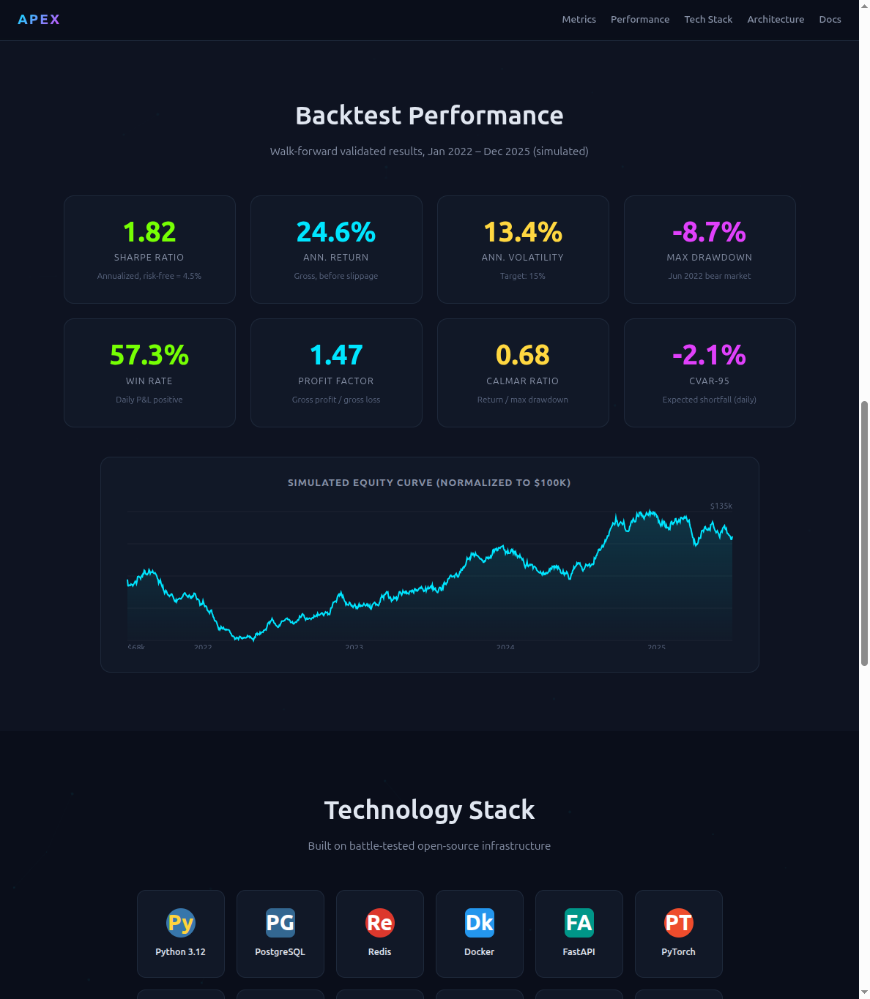
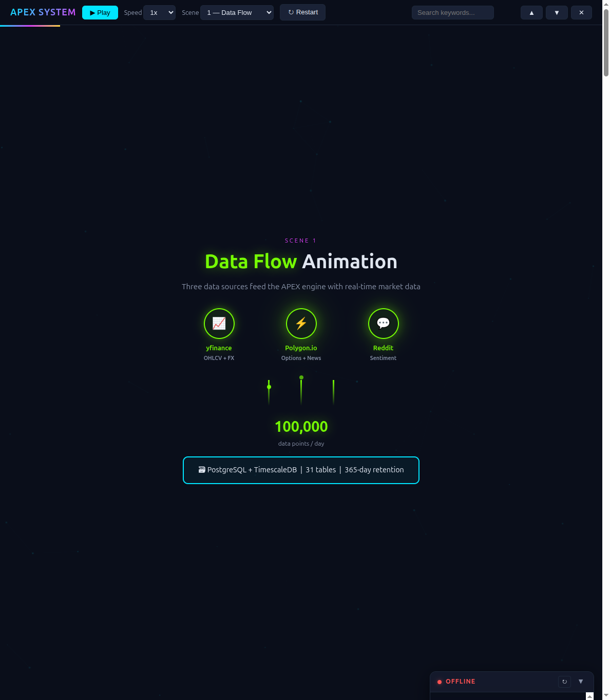
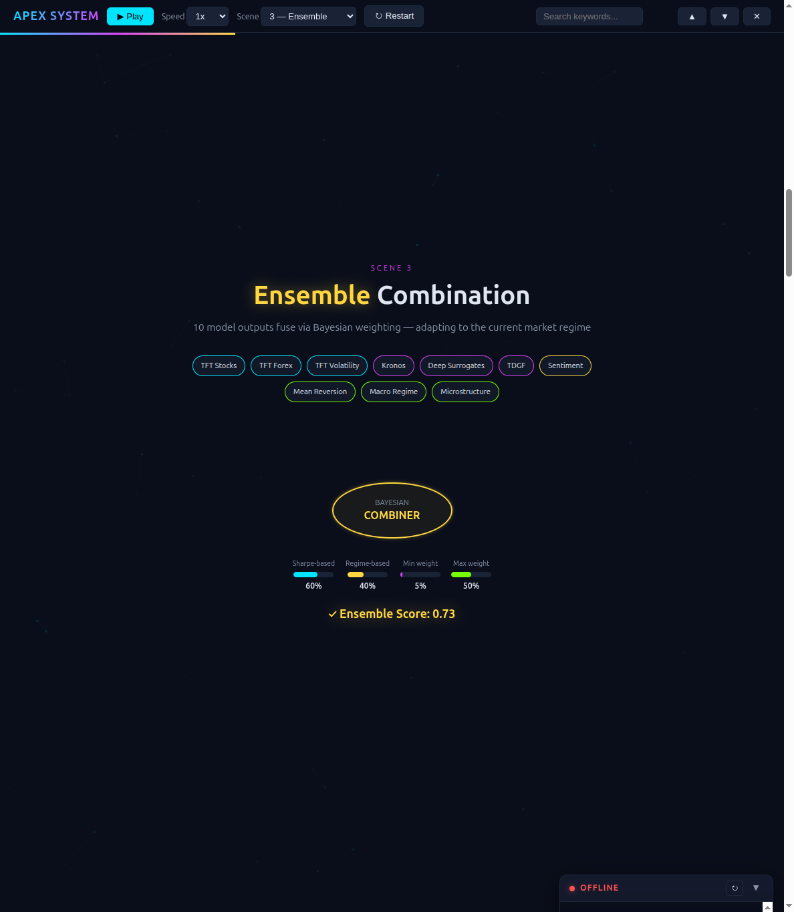
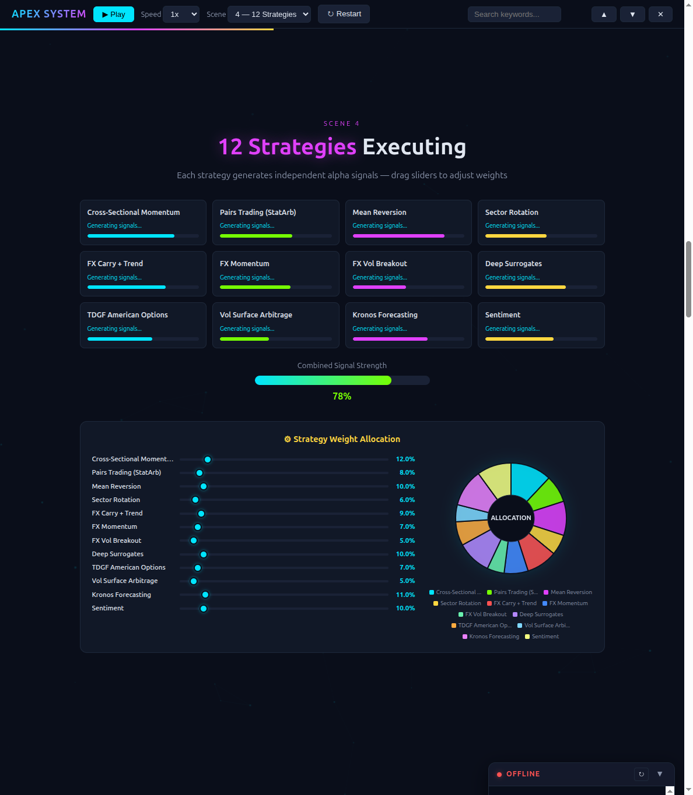

# APEX Trading Platform - Interactive Showcase

Interactive documentation for the **APEX multi-strategy algorithmic trading platform** — a production-grade system with 10 ML models, 12 trading strategies, 5 safety guardrails, and full microservices infrastructure.

## Live Demo

**https://axumweyane.github.io/apex-showcase/**

## Screenshots

### Landing Page with Backtest Performance

### Animated System Tour

## Pages

| Page | Description |
|------|-------------|
| [Landing Page](https://axumweyane.github.io/apex-showcase/) | Platform overview with animated metrics, backtest performance, tech stack |
| [Animated System Tour](https://axumweyane.github.io/apex-showcase/system.html) | 10-scene interactive journey through the entire APEX pipeline |
| [Visual Architecture Guide](https://axumweyane.github.io/apex-showcase/guide.html) | Printable reference with tables, diagrams, and the 17-step pipeline |
| [One-Page Summary](https://axumweyane.github.io/apex-showcase/summary.html) | Print-to-PDF executive summary for investors and employers |

## Features

### Animated System Tour
- 10 animated scenes: Data Flow, Models, Ensemble, Strategies, Guardrails, Testing, Execution, Database, Monitoring, Daily Cycle
- Clickable model cards with expandable details (purpose, data, accuracy)
- Toggle switches on safety guardrails showing failure scenarios
- Draggable strategy weight sliders with live pie chart
- Full-text search with keyword highlighting
- Live data panel connecting to the paper trader API
- Play/Pause, speed control, scene selector, confetti finale

### Platform Metrics
- **10 ML models** across 4 asset classes (stocks, forex, options, cross-asset)
- **12 trading strategies** with regime-adaptive Bayesian ensemble
- **5 safety guardrails** for automated pre-trade risk checks
- **970 tests** across 30 test modules
- **179 Python files** with full production infrastructure
- **5 microservices** coordinated via Kafka with DLQ

## Tech Stack

Python 3.12, PyTorch, FastAPI, PostgreSQL, TimescaleDB, Redis, Kafka, Docker, Prometheus, Grafana, MLflow, Alpaca API

## Source Code

The main APEX codebase is at [github.com/axumweyane/lastcode10](https://github.com/axumweyane/lastcode10).

## License

This showcase is for demonstration purposes.
